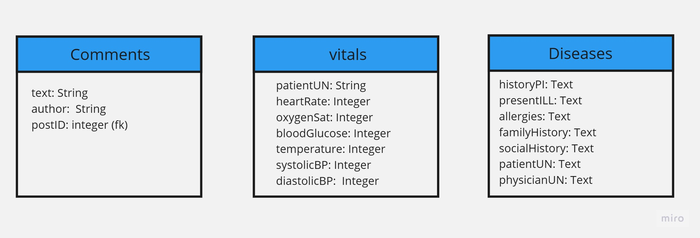
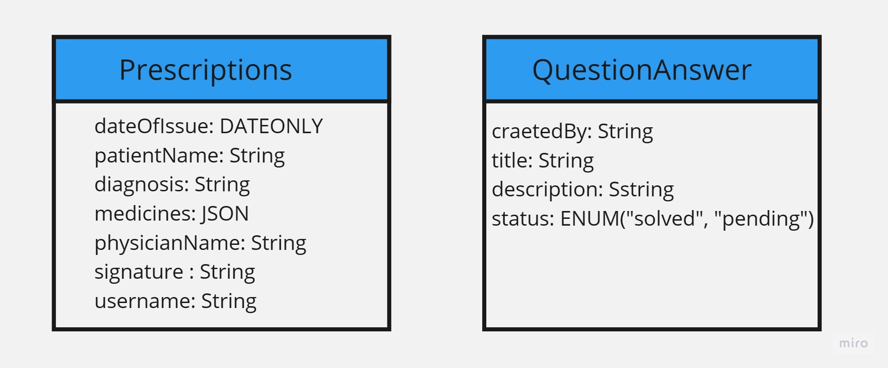
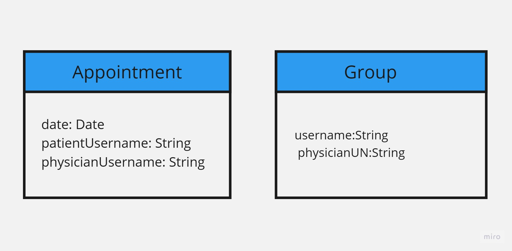
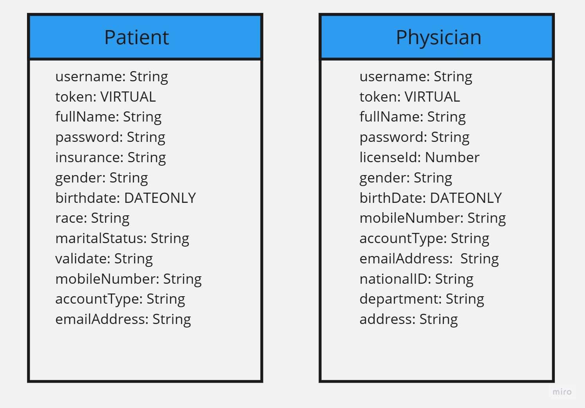

# Healthak

## Team members

- Tasneem Hassasneh
- Abdullah aljoulani
- Anas Nemrawi
- Hasan Tummalei

## Description

**Healthak** is a portable Pharmacy/Clinic web application that aims to provide medical services, patient profiles, disease control, physician dashboards, patient groups, appointment scheduling, and communication channels.
The application's focus is on providing seamless communication between patients and physicians, personalized patient health tracking, and educational resources for patients. Physicians can monitor their patients' health, receive alerts, and engage in real-time consultations.

## Wireframe

[Wireframe](https://miro.com/app/board/uXjVMx2wquE=/)

## Features

**Title: User Registration.**

*As a potential user, I want to register on the healthcare platform to access personalized health profiles and connect with my healthcare provider.*
​
**Feature Tasks:**

- Design a user registration form with fields for first name, last name, email, and password.
- Implement server-side validation to ensure accurate and complete user data.
- Store the registered user's information securely in the database.
​
**Acceptance Tests:**

- Verify that the registration form captures all required user details correctly.
- Test that the server validates the form data and provides appropriate error messages for any invalid entries.
- Confirm that the user data is securely stored in the database.

---
​
**Title: User Login**

*As a registered user, I want to log in to the healthcare platform to access my health profile and communicate with my healthcare provider.*

**Feature Tasks:**

- Design a user login page with fields for email and password.
- Implement server-side authentication to verify user credentials.
- Retrieve the user's health profile data upon successful login.
- Provide access to the user's personalized dashboard.

**Acceptance Tests:**

- Check that the user's health profile data is retrieved correctly upon successful login.
- Ensure that the personalized dashboard is accessible after successful login.

---

**Title: Health Profile Management.**

*As a user, I want to manage my health profile by entering and updating health parameters and receiving a weekly health status summary.*

**Feature Tasks:**

- Design a summary section to generate the user's weekly health status summary.
- Store health parameter data securely in the database.

**Acceptance Tests:**

- Verify that the health profile page displays existing health parameters accurately.
- Test the functionality of posting, updating, and deleting health parameters.
- Confirm that the summary section generates the user's weekly health status summary correctly.

---
​
**Title: Patient-Physician Communication**

*As a patient, I want to communicate with my physician in real-time to ask health-related queries and receive prompt responses.*

**Feature Tasks:**

- Implement a real-time chat system between patients and physicians.
- Store chat history securely for future reference.
​
**Acceptance Tests:**

- Test the real-time functionality of the chat system for smooth communication.
- Confirm that chat history is securely stored and accessible to the respective users.

---

**Title: Educational Groups.**

*As a physician, I want to create groups for patients to provide health-related information and resources.*
​
**Feature Tasks:**

- Design a page for physicians to create and manage groups.
- Provide physicians with the ability to post l in the groups.
​
**Acceptance Tests:**

- Verify that physicians can create and manage educational groups successfully.
- Confirm that physicians can post educational content and resources for patients.

## our Schemas

## PM Tools

1. **Trello** project management tool to distribution
 of tasks to the team.

2. **Miro** to draw wireframe for the project.

3. **GitHub Projects** to create boards and manage tasks using GitHub issues and pull requests.

4. **Slack** to communicate with the team.

5. **Discord** to share the work together and fix the error's as a team.

6. **Visual Studio Code** to write the code.

7. **Render** to build and run the website.

## Table of content

| Topics        | Links           |
|    ---             |      ---        |
|1- ProjectDescription   |      [Read](./AboutTheProject/ProjectDescription.md)     |
|2- Repo&Tooling   |      [Read](./AboutTheProject/Repo&Tooling.md)     |
|3- TeamManagement   |      [Read](./AboutTheProject/TeamManagement.md)     |
|4- Wireframes&SoftwareRequirements   |      [Read](./AboutTheProject/Wireframes&SoftwareRequirements.md)     |
|5- Routes Documentation   |      [Read](./AboutTheProject//RoutesDocumentation.md)     |
# front-end
